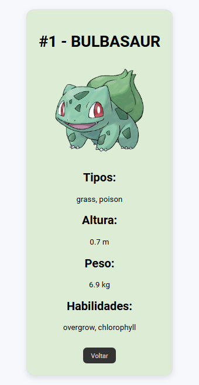

# ✨Pokédex – Projeto DIO

## 📍Descrição
Este projeto faz parte de um desafio do curso da Digital Innovation One (DIO).
A proposta é realizar um fork do projeto original da Pokédex, estudar sua estrutura e então modificar e aprimorar o código utilizando os conhecimentos adquiridos em JavaScript, HTML e CSS.

## 📍Página de Detalhes 
Ao clicar em um Pokémon, o usuário é levado para uma página com mais informações, como:

- Tipo
- Altura
- Peso
- Habilidades

## 📍Layout Personalizado
Foram aplicadas melhorias visuais na interface, mantendo a base do projeto da DIO.

## 📍Código Organizado
Estrutura reorganizada para facilitar leitura e manutenção:

- Arquivos separados por responsabilidade
- Novo CSS para detalhes
- Novo JS para lógica da página de detalhes

## 📍Tecnologias Utilizadas

- HTML
- CSS
- JavaScript
- PokeAPI
- Projeto base fornecido pela DIO

## 📷Imagem do Projeto

